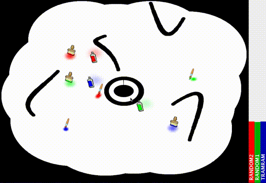
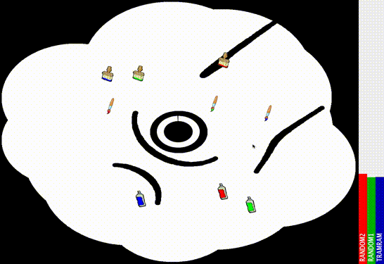
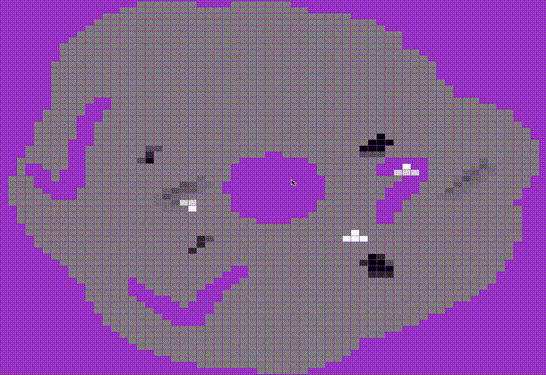

# Kibifub 
is a university project where we were provided with a server and had to implement an 'ai' for fighting in the world of brushes!

## Captured games
This are two example games with 2 random bots and one with the implementation from me

And here is a view I made so I can see what my program see's and does (note this is not one of the above games)

## Run & Watch
To run the code you have first to start the server from the root directory:

    java -jar libs/kipifub.jar

when the server has started you have to run the main method of de.htw.sebastiankapunkt.kipfub.client.ClientStarter.
For that I reccomend to use an IDE and setup gradle.

## For more documentation take a look at this pdf:
[kibifub.pdf](assets/kibifub_sebastian_kindt_s0555665.pdf)

